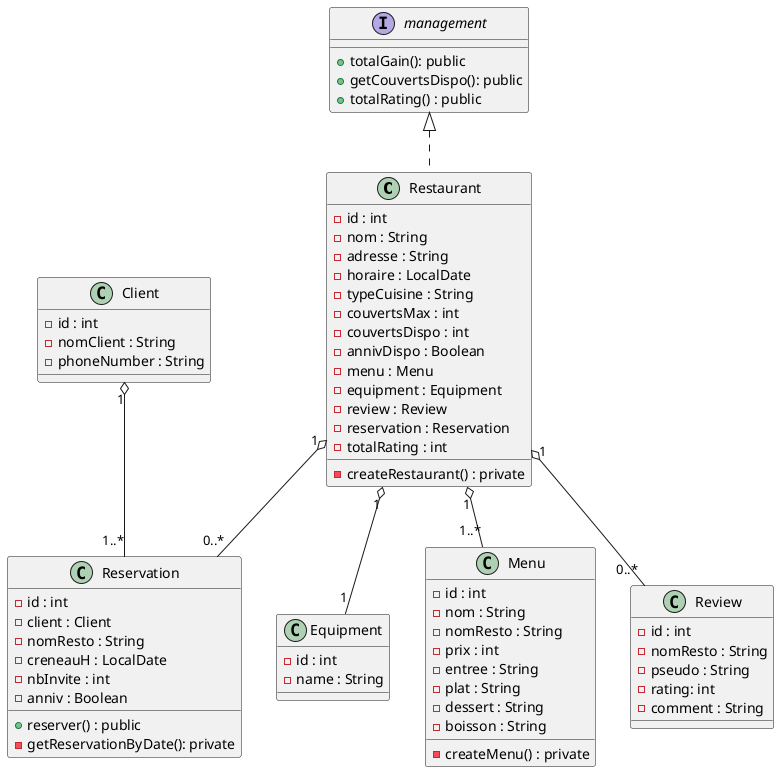

# Application de Gestion de Restaurant

## Prérequis
Pour exécuter le projet, vous devez d'abord démarrer Docker :
- Exécutez `docker-compose up -d` dans le terminal à la racine du projet pour lancer les conteneurs Docker nécessaires.

## Connexion à la Base de Données
- **Nom de la base de données** : `restaurant`
- **Nom d'utilisateur** : `restaurantadmin`
- **Mot de passe** : `restaurant`

## Lien de Base
L'application est accessible à l'adresse suivante en local :
- `http://localhost:8080`

## Routes Principales
- `http://localhost:8080/api/restaurant/swagger-ui/index.html`

## Documentation API
La documentation de l'API est accessible via Swagger UI à l'adresse suivante : `http://localhost:8080/api/restaurant/docs`.
Cette interface vous permet de visualiser et de tester toutes les routes disponibles de l'API.

## Diagramme UML

Ci-dessous, le modèle UML simplifié de l'application :

Ce modèle illustre les principales entités de l'application et leurs relations.